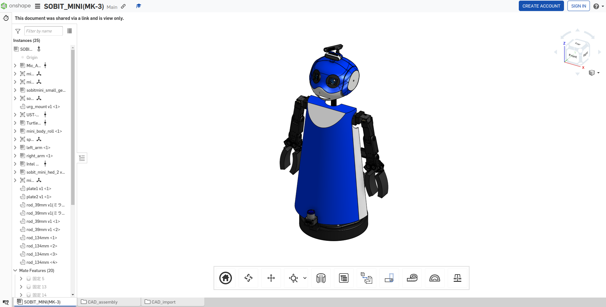

<a name="readme-top"></a>

[JA](README.md) | [EN](README.en.md)

[![Contributors][contributors-shield]][contributors-url]
[![Forks][forks-shield]][forks-url]
[![Stargazers][stars-shield]][stars-url]
[![Issues][issues-shield]][issues-url]
[![License][license-shield]][license-url]

# SOBIT MINI

<!--TABLE OF CONTENTS-->
<details>
   <summary>Table of Contents</summary>
   <ol>
    <li>
      <a href="#introduction">Introduction</a>
    </li>
    <li>
      <a href="#getting-started">Getting Started</a>
      <ul>
        <li><a href="#prerequisites">Prerequisites</a></li>
        <li><a href="#installation">Installation</a></li>
      </ul>
    </li>
    <li>
    <a href="#launch-and-usage">Launch and Usage</a>
      <ul>
        <li><a href="#visualization-on-rviz">Visualization on Rviz</a></li>
      </ul>
    </li>
    <li>
    <a href="#software">Software</a>
      <ul>
        <li><a href="#joint-controller">Joint Controller</a></li>
        <li><a href="#wheel-controller">Wheel Controller</a></li>
      </ul>
    </li>
    <li>
    <a href="#hardware">Hardware</a>
      <ul>
        <li><a href="#how-to-download-3d-parts">How to download 3D Parts</a></li>
        <li><a href="#electronic-circuit-diagram">Electronic circuit Diagram</a></li>
        <li><a href="#robot-assembly">Robot Assembly</a></li>
        <li><a href="#features">Features</a></li>
        <li><a href="#bill-of-material-BOM">Bill of Material (BOM)</a></li>
      </ul>
    </li>
    <li><a href="#milestone">Milestone</a></li>
    <!-- <li><a href="#contributing">Contributing</a></li> -->
    <!-- <li><a href="#license">License</a></li> -->
    <li><a href="#acknowledgments">Acknowledgments</a></li>
   </ol>
</details>

<!--Introduction to the Repository-->
## Introduction


This is a library to operate the dual-arm mobile manipulator (SOBIT MINI) developed by SOBITS.

> [!WARNING]
> If you are a beginner, have a senior colleague accompany you while you work on the actual robot.

<p align="right">(<a href="#readme-top">back to top</a>)</p>

<!-- Getting Started -->
## Getting Started

This section describes how to set up this repository.

### Prerequisites

First, please prepare the following environment before proceeding to the next installation stage.

| System  | Version |
| ------------- | ------------- |
| Ubuntu | 20.04 (Focal Fossa) |
| ROS | Noetic Ninjemys |
| Python | 3.0~ |

> [!NOTE]
> For information on how to install `Ubuntu` or `ROS`, please refer to the [SOBIT Manual](https://github.com/TeamSOBITS/sobits_manual#%E9%96%8B%E7%99%BA%E7%92%B0%E5%A2%83%E3%81%AB%E3%81%A4%E3%81%84%E3%81%A6).

<!-- - OS: Ubuntu 20.04 
- ROS distribution: noetic Kame -->

### Installation

1. Go to the `src` folder of ROS.
   ```sh
   $ roscd
   # Or go to "cd ~/catkin_ws/".
   $ cd src/
   ```
2. Clone this repository.
   ```sh
   $ git clone https://github.com/TeamSOBITS/sobit_mini
   ```
3. Go to the repository.
   ```sh
   $ cd sobit_mini/
   ```
4. Install dependent packages.
   ```sh
   $ bash install.sh
   ```
5. Compile the package.
   ```sh
   $ roscd
   # Or go to "cd ~/catkin_ws/".
   $ catkin_make
   ```

<p align="right">(<a href="#readme-top">back to top</a>)</p>


<!-- Launch and Usage -->
## Launch and Usage

1. Launch the launch file [minimal.launch](sobit_mini_bringup/launch/minimal.launch)
   ```sh
   $ roslaunch sobit_mini_bringup minimal.launch
   ```
2. [Optional] Let's run the demo program.
   ```sh
   $ rosrun sobit_mini_library test_control_wheel.py
   ```

> [!NOTE]
> Check the [example](sobit_mini_library/example/) folder to become familiar with how SOBIT MINI works, and learn the working functions from each sample file.

<p align="right">(<a href="#readme-top">back to top</a>)</p>


### Visualization on Rviz
SOBIT MINI can be visualized on Rviz to display the robot's configuration before the actual machine is put into operation.

```sh
$ roslaunch sobit_mini_description display.launch
```

If it works correctly, Rviz will be displayed as follows


<p align="right">(<a href="#readme-top">back to top</a>)</p>


## Software
<details>
<summary>Summary of information on SOBIT MINI and related software</summary>


### Joint Controller
This is a summary of information for moving the pan-tilt mechanism and manipulators of the SOBIT MINI.

<p align="right">(<a href="#readme-top">back to top</a>)</p>


#### 動作関数
1.  `moveToPose()` : Move it to a predetermined pose.
   ```cpp
   bool moveToPose(
      const std::string &pose_name, //Pose Name
      const double sec              // Whether to wait after rotation
   );
   ```

> [!NOTE]
> Existing poses can be found in [sobit_mini_pose.yaml](sobit_mini_library/config/sobit_mini_pose.yaml).

2. `moveHeadPanTilt` : Move the pan-tilt mechanism to the desired angle.
   ```cpp
   bool moveHeadPanTilt(
      const double pan_rad,         // Angle of rotation [rad]
      const double tilt_rad,        // Angle of rotation [rad]
      const double sec,             // Rotation time [s]
      bool is_sleep                 // Whether to wait after rotation
   )
   ```

3. `moveRightArm` : Move the right arm joint to the desired angle.
   ```cpp
   bool moveRightArm(
      const double shoulder_roll,   // Angle of rotation [rad]
      const double shoulder_pan,    // Angle of rotation [rad]
      const double elbow_tilt,      // Angle of rotation [rad]
      const double wrist_tilt,      // Angle of rotation [rad]
      const double hand_motor,      // Angle of rotation [rad]
      const double sec,             // Rotation time [s]
      bool is_sleep                 // Whether to wait after rotation
   )
   ```

4. `moveLeftArm` : Move the right arm joint to the desired angle.
   ```cpp
   bool moveLeftArm(
      const double shoulder_roll,   // Angle of rotation [rad]
      const double shoulder_pan,    // Angle of rotation [rad]
      const double elbow_tilt,      // Angle of rotation [rad]
      const double wrist_tilt,      // Angle of rotation [rad]
      const double hand_motor,      // Angle of rotation [rad]
      const double sec,             // Rotation time [s]
      bool is_sleep                 // Whether to wait after rotation
   )
   ```

5. `moveJoint` : Moves a specified joint to an arbitrary angle.
   ```cpp
   bool moveJoint(
      const Joint joint_num,  // Joint Name (Constant Name)
      const double rad,       // Angle of rotation [rad]
      const double sec,       // Rotation time [s]
      bool is_sleep           // Whether to wait after rotation
   )
   ```

6. `moveAllJoint` : All joints can be moved to any angle.
   ```cpp
   bool moveAllJoint(
      const double l_arm_shoulder_roll_joint,   // Angle of rotation [rad]
      const double l_arm_shoulder_pan_joint,    // Angle of rotation [rad]
      const double l_arm_elbow_tilt_joint,      // Angle of rotation [rad]
      const double l_hand_joint,                // Angle of rotation [rad]
      const double r_arm_shoulder_roll_joint,   // Angle of rotation [rad]
      const double r_arm_shoulder_pan_joint,    // Angle of rotation [rad]
      const double r_arm_elbow_tilt_joint,      // Angle of rotation [rad]
      const double r_arm_wrist_tilt_joint,      // Angle of rotation [rad]
      const double r_hand_joint,                // Angle of rotation [rad]
      const double body_roll_joint,             // Angle of rotation [rad]
      const double head_pan_joint,              // Angle of rotation [rad]
      const double head_tilt_joint,             // Angle of rotation [rad]
      const double sec,                         // Rotation time [s]
      bool is_sleep                             // Whether to wait after rotation
   )
   ```

7. `moveGripperToTargetCoord` : Move the hand to xyz coordinates (grasp mode).
   ```cpp
   bool moveGripperToTargetCoord(
      const int arm_mode,                 // Arm to be used (arm_mode=0:left arm, arm_mode=1:left arm)
      const double hand_rad,              // Adjustment of hand opening and closing angles
      const double goal_position_x,       // x [m] of the grasp destination
      const double goal_position_y,       // y [m] of the grasp destination
      const double goal_position_z,       // z [m] of the grasp destination
      const double diff_goal_position_x,  // Shift the x-axis of the xyz coordinate [m].
      const double diff_goal_position_y,  // Shift the y-axis of the xyz coordinate [m].
      const double diff_goal_position_z,  // Shift the z-axis of the xyz coordinate [m].
      const double sec,                   // Rotation time [s]
      bool is_sleep                       // Whether to wait after rotation
   )
   ```

8. `moveGripperToTargetTF` : Move the hand to the tf name (grasp mode).
   ```cpp
   bool moveGripperToTargetTF(
      const int arm_mode,                    // Arm to be used (arm_mode=0:left arm, arm_mode=1:left arm)
      const std::string &goal_position_name, // Grasp purpose tf name
      const double hand_rad,                 // Adjustment of hand opening and closing angles
      const double diff_goal_position_x,     // Shift the x-axis of the xyz coordinate [m].
      const double diff_goal_position_y,     // Shift the y-axis of the xyz coordinate [m].
      const double diff_goal_position_z,     // Shift the z-axis of the xyz coordinate [m].
      const double sec,                      // Rotation time [s]
      bool is_sleep                          // Whether to wait after rotation
   )
   ```

<p align="right">(<a href="#readme-top">back to top</a>)</p>

#### Joint Name

SOBIT MINI joint names and their constant names are as follows

| joint number | Joint Name | Joint constant name |
| :---: | --- | --- |
| 0 | l_arm_shoulder_roll_joint | L_ARM_SHOULDER_ROLL_JOINT |
| 1 | l_arm_shoulder_pan_joint | L_ARM_SHOULDER_PAN_JOINT |
| 2 | l_arm_elbow_tilt_joint | L_ARM_ELBOW_TILT_JOINT |
| 3 | l_arm_wrist_tilt_joint | L_ARM_WRIST_TILT_JOINT |
| 4 | l_hand_joint | L_HAND_JOINT |
| 5 | r_arm_shoulder_roll_joint | R_ARM_SHOULDER_ROLL_JOINT |
| 6 | r_arm_shoulder_pan_joint | R_ARM_SHOULDER_PAN_JOINT |
| 7 | r_arm_elbow_tilt_joint | R_ARM_ELBOW_ROLL_JOINT |
| 8 | r_arm_wrist_tilt_joint | R_ARM_WRIST_TILT_JOINT |
| 9 | r_hand_joint | R_HAND_JOINT |
| 10 | body_roll_joint | BODY_ROLL_JOINT |
| 11 | head_pan_joint | HEAD_PAN_JOINT |
| 12 | head_tilt_joint | HEAD_TILT_JOINT |

<p align="right">(<a href="#readme-top">back to top</a>)</p>


#### How to set poses

Poses can be added and edited in the file [sobit_mini_pose.yaml](sobit_mini_library/config/sobit_mini_pose.yaml). The format is as follows.

```yaml
sobit_mini_pose:
    - { 
        pose_name: "pose_name",
        l_arm_shoulder_roll_joint: 0.0,
        l_arm_shoulder_pan_joint: -1.25,
        l_arm_elbow_tilt_joint: 0.0,
        l_arm_wrist_tilt_joint: 0.0,
        l_hand_joint: 0.0,
        r_arm_shoulder_roll_joint: 0.0,
        r_arm_shoulder_pan_joint: -1.25,
        r_arm_elbow_tilt_joint: 0.0,
        r_arm_wrist_tilt_joint: 0.0,
        r_hand_joint: 0.0,
        body_roll_joint: 0.0,
        head_pan_joint: 0.0,
        head_tilt_joint: 0.0
    }
```

### Wheel Controller

This is a summary of information for moving the mobile mechanism part of SOBIT MINI.


#### 動作関数

1. `controlWheelLinear()` : Move the unit in parallel (forward/backward).
   ```cpp
   bool controlWheelLinear(const double distance      //Straight travel distance in x direction
   )
   ```

2. `controlWheelRotateRad()` : Perform rotational motion (arc degree method: Radian)
   ```cpp
   bool controlWheelRotateRad(const double angle_rad  // Angle of rotation [rad]
   )
   ```

3. `controlWheelRotateDeg()` : Perform rotary motion (Degree method: Degree)
   ```cpp
   bool controlWheelRotateDeg(const double angle_deg  // Angle of rotation [deg]
   )
   ```

</details>

<p align="right">(<a href="#readme-top">back to top</a>)</p>

## Hardware

SOBIT MINI is available as open source hardware at [Onshape](https://cad.onshape.com/documents/8875b6e7a5f6f87b4f951969/w/d265c3a1708d61e2a005595d/e/00 fdacbdb703dc27e5e0d3f8).



<p align="right">(<a href="#readme-top">back to top</a>)</p>

<details>
<summary>For more information on hardware, please click here.</summary>

### How to download 3D Parts

1. Access Onshape.

> [!NOTE]
> You do not need to create an `OnShape` account to download files. However, if you wish to copy the entire document, we recommend that you create an account.

2. Select the part in the `Instance` by right-clicking on it.
3. A list will be displayed, and then press the `Export` button.
4. In the window that appears, there is a `Format` item. Select `STEP`.
5. Finally, press the blue `Export` button to start the download.

<p align="right">(<a href="#readme-top">back to top</a>)</p>

### Electronic circuit Diagram

TBD

<p align="right">(<a href="#readme-top">back to top</a>)</p>


### Robot Assembly

TBD

<p align="right">(<a href="#readme-top">back to top</a>)</p>


### Features

| Item | Details |
| --- | --- |
| Maximum linear velocity | 0.65[m/s] |
| Maximum Rotational Speed | 3.1415[rad/s] |
| Maximum Payload | 0.35[kg] |
| Size (LxWxH) | 512x418x1122[mm] |
| Weight | 11.6[kg] |
| Remote Controller | PS3/PS4 |
| LiDAR | UST-10LX |
| RGB-D | Intel Realsense D435F |
| Speaker | Mono Speaker |
| Microphone | Condenser Microphone |
| Actuator (movement mechanism) | 2 x XM540-W150, 9 x XM430-W320 |
| Move base | TurtleBot2 |
| Power Supply | 2 x Makita 6.0Ah 18V |
| PC Connection | USB |


### Bill of Material (BOM)

| Part | Model Number | Quantity | Where to Buy |
| --- | --- | --- | --- |
| --- | --- | 1 | [link]() |
| --- | --- | 1 | [link]() |
| --- | --- | 1 | [link]() |
| --- | --- | 1 | [link]() |
| --- | --- | 1 | [link]() |
| --- | --- | 1 | [link]() |
| --- | --- | 1 | [link]() |
| --- | --- | 1 | [link]() |
| --- | --- | 1 | [link]() |
| --- | --- | 1 | [link]() |
| --- | --- | 1 | [link]() |
| --- | --- | 1 | [link]() |
| --- | --- | 1 | [link]() |


</details>

<p align="right">(<a href="#readme-top">back to top</a>)</p>


<!-- Milestone -->
## Milestone

- [x] Correction of example file
- [x] OSS
    - [x] Enhanced documentation
    - [x] Unified coding style

Please visit [Issue page][issues-url] to see the current bag and new feature requests.

<p align="right">(<a href="#readme-top">back to top</a>)</p>

<!-- Acknowledgments -->
## Acknowledgments

* [Dynamixel SDK](https://emanual.robotis.com/docs/en/software/dynamixel/dynamixel_sdk/overview/)
* [ROS Noetic](http://wiki.ros.org/noetic)
* [ROS Control](http://wiki.ros.org/ros_control)


<!-- MARKDOWN LINKS & IMAGES -->
<!-- https://www.markdownguide.org/basic-syntax/#reference-style-links -->
[contributors-shield]: https://img.shields.io/github/contributors/TeamSOBITS/sobit_mini.svg?style=for-the-badge
[contributors-url]: https://github.com/TeamSOBITS/sobit_mini/graphs/contributors
[forks-shield]: https://img.shields.io/github/forks/TeamSOBITS/sobit_mini.svg?style=for-the-badge
[forks-url]: https://github.com/TeamSOBITS/sobit_mini/network/members
[stars-shield]: https://img.shields.io/github/stars/TeamSOBITS/sobit_mini.svg?style=for-the-badge
[stars-url]: https://github.com/TeamSOBITS/sobit_mini/stargazers
[issues-shield]: https://img.shields.io/github/issues/TeamSOBITS/sobit_mini.svg?style=for-the-badge
[issues-url]: https://github.com/TeamSOBITS/sobit_mini/issues
[license-shield]: https://img.shields.io/github/license/TeamSOBITS/sobit_mini.svg?style=for-the-badge
[license-url]: LICENSE
