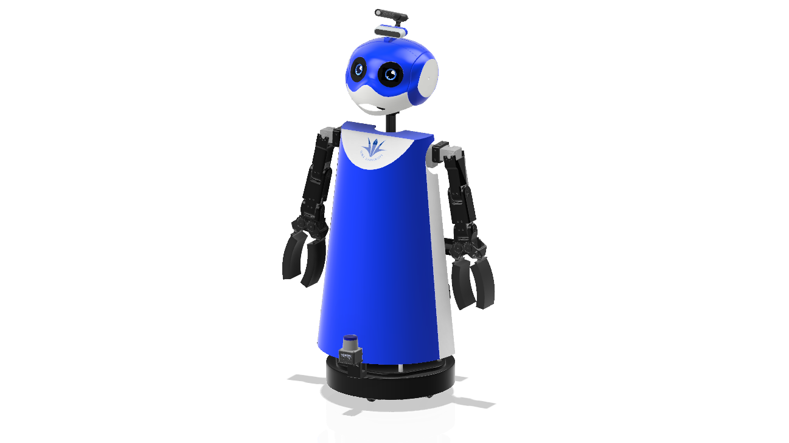
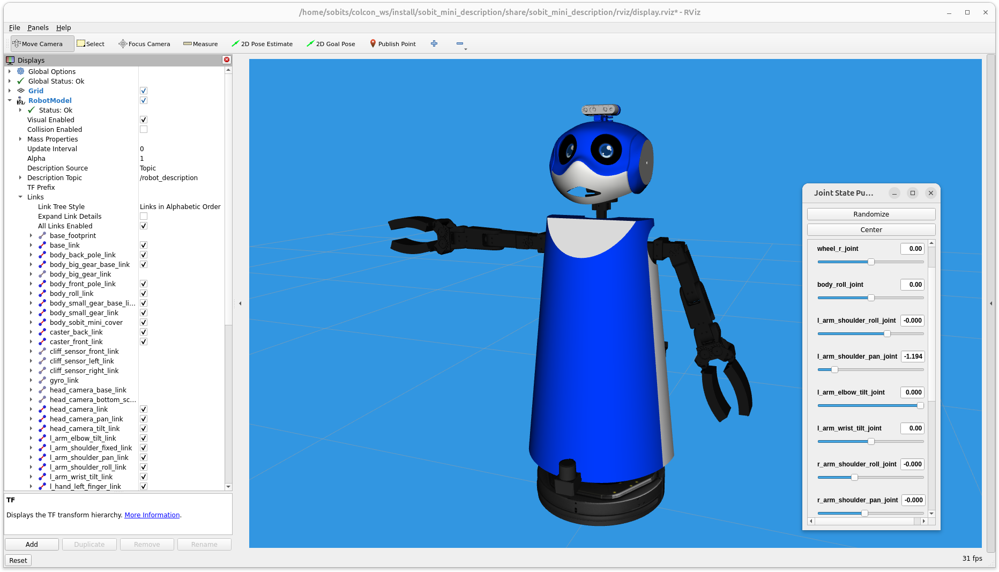
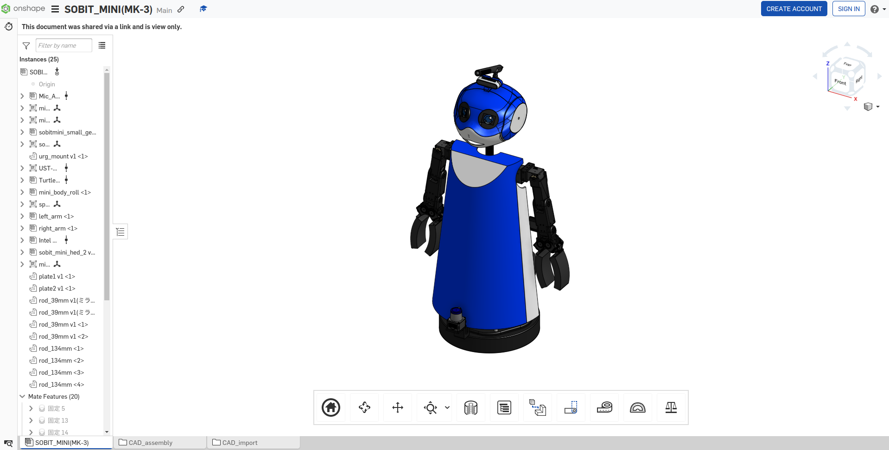

<a name="readme-top"></a>

[JA](README.md) | [EN](README.en.md)

[![Contributors][contributors-shield]][contributors-url]
[![Forks][forks-shield]][forks-url]
[![Stargazers][stars-shield]][stars-url]
[![Issues][issues-shield]][issues-url]
[![License][license-shield]][license-url]

# SOBIT MINI

<details>
  <summary>目次</summary>
  <ol>
    <li><a href="#概要">概要</a></li>
    <li>
      <a href="#セットアップ">セットアップ</a>
      <ul>
        <li><a href="#環境条件">環境条件</a></li>
        <li><a href="#インストール方法">インストール方法</a></li>
      </ul>
    </li>
    <li>
      <a href="#操作方法">操作方法</a>
      <ul>
        <li><a href="#rviz上の可視化">Rviz上の可視化</a></li>
      </ul>
    </li>
    <li>
      <a href="#ソフトウェア">ソフトウェア</a>
      <ul>
        <li><a href="#ジョイント関連のアクションサーバー">ジョイント関連のアクションサーバー</a></li>
        <li><a href="#リニア関連のアクションサーバー">リニア関連のアクションサーバー</a></li>
        <li><a href="#ポーズの設定方法">ポーズの設定方法</a></li>
      </ul>
    </li>
    <li>
      <a href="#ハードウェア">ハードウェア</a>
      <ul>
        <li><a href="#パーツのダウンロード方法">パーツのダウンロード方法</a></li>
        <li><a href="#電子回路図">電子回路図</a></li>
        <li><a href="#ロボットの組み立て">ロボットの組み立て</a></li>
        <li><a href="#ロボットの特徴">ロボットの特徴</a></li>
        <li><a href="#部品リストbom">部品リスト（BOM）</a></li>
      </ul>
    </li>
    <li><a href="#マイルストーン">マイルストーン</a></li>
    <li><a href="#参考文献">参考文献</a></li>
  </ol>
</details>

## 概要


SOBITSが開発した双腕型モバイルマニピュレータ（SOBIT MINI）を動かすためのライブラリです．

> [!warning]
> 初心者の場合，実機のロボットを扱う際に，先輩方に付き添ってもらいながらロボットを動かしましょう．

## セットアップ
ここで，本レポジトリのセットアップ方法について説明します．

### 環境条件
まず，以下の環境を整えてから，次のインストール段階に進んでください．

| System  | Version |
| --- | --- |
| Ubuntu | 22.04 (Jammy Jellyfish) |
| ROS    | Humble Hawksbill |
| Python | 3.10 |

> [!NOTE]
> `Ubuntu`や`ROS`のインストール方法に関しては，[SOBIT Manual](https://github.com/TeamSOBITS/sobits_manual#%E9%96%8B%E7%99%BA%E7%92%B0%E5%A2%83%E3%81%AB%E3%81%A4%E3%81%84%E3%81%A6)に参照してください．

### インストール方法

1. ROS2の`src`フォルダに移動します．
    ```sh
    cd ~/colcon_ws/src/
    ```

2. 本レポジトリをcloneします．
   ```sh
   git clone -b feature/multi_control https://github.com/TeamSOBITS/sobit_mini
   ```
3. レポジトリの中へ移動します．
   ```sh
   cd sobit_mini/
   ```
4. 依存パッケージをインストールします．
   ```sh
   bash install.sh
   ```
5. パッケージをコンパイルします．
    ```sh
    cd ~/colcon_ws
    colcon build --symlink-install
    source ~/colcon_ws/install/setup.sh
    ```

## 操作方法

1. [minimal.launch](sobit_mini_bringup/launch/minimal.launch.py)というlaunchファイルを起動します．
   ```sh
   ros2 launch sobit_mini_bringup minimal.launch.py
   ```
2. [任意] ロボットのポーズを変更してみましょう．
   ```sh
   ros2 action send_goal /sobit_mini/move_to_pose sobits_interfaces/action/MoveToPose "pose_name: 'detecting_pose'
   time_allowance:
      sec: 5
      nanosec: 0"
   ```

### Rviz上の可視化
実機を動かす前段階で，Rviz上でSOBIT MINIを可視化し，ロボットの構成を表示することができます．

```sh
ros2 launch sobit_mini_description display.launch.py
```

正常に動作した場合は，次のようにRvizが表示されます．



## ソフトウェア
<details>
<summary>SOBIT MINIと関わるソフトの情報まとめ</summary>

### ジョイント関連のアクションサーバー

1. `/sobit_mini/move_joint`：指定した関節を指定した角度に動かす
   ```sh
   ros2 action send_goal /sobit_mini/move_joint sobits_interfaces/action/MoveJoint "target_joint_names: ['head_camera_pan_joint', 'l_arm_shoulder_pan_joint']
   target_joint_rad: [0.5, -0.7]
   time_allowance:
      sec: 5
      nanosec: 0"
   ```
   <details>
   <summary>SOBIT MINIのジョイント名</summary>

   | ジョイント名 |
   | :--- |
   | r_arm_shoulder_roll_joint |
   | r_arm_shoulder_pan_joint |
   | r_arm_elbow_tilt_joint |
   | r_arm_wrist_tilt_joint |
   | r_hand_joint |
   | l_arm_shoulder_roll_joint |
   | l_arm_shoulder_pan_joint |
   | l_arm_elbow_tilt_joint |
   | l_arm_wrist_tilt_joint |
   | l_hand_joint |
   | body_roll_joint |
   | head_camera_pan_joint |
   | head_camera_tilt_joint |

2. `/sobit_mini/move_to_pose`：事前に指定したポーズに動かす
   ```sh
   ros2 action send_goal /sobit_mini/move_to_pose sobits_interfaces/action/MoveToPose "pose_name: 'initial_pose'
   time_allowance:
      sec: 5
      nanosec: 0"
   ```

### リニア関連のアクションサーバー

1. `/sobit_mini/move_wheel_linear`：指定した速度でロボットを移動させる
   ```sh
   ros2 action send_goal /sobit_mini/move_wheel_linear sobits_interfaces/action/MoveWheelLinear "target_point:
      x: 0.5
      y: 0.0
      z: 0.0
   time_allowance:
      sec: 3
      nanosec: 0"
   ```

2. `/sobit_mini/move_wheel_rotate`：指定した角度でロボットを回転させる
   ```sh
   ros2 action send_goal /sobit_mini/move_wheel_rotate sobits_interfaces/action/MoveWheelRotate "target_yaw: -1.57
   time_allowance:
      sec: 5
      nanosec: 0"
   ```

#### ポーズの設定方法

[sobit_mini_pose.yaml](sobit_mini_library/config/pose_list.yaml)というファイルでポーズの追加・編集ができます．以下のようなフォーマットになります．

```yaml
/**:
  ros__parameters:
    poses:
      - initial_pose

    initial_pose:
      r_arm_shoulder_roll :  0.0
      r_arm_shoulder_pan  :  1.25
      r_arm_elbow_tilt    :  0.0
      r_arm_wrist_tilt    :  0.0
      r_hand              :  0.0
      l_arm_shoulder_roll :  0.0
      l_arm_shoulder_pan  : -1.25
      l_arm_elbow_tilt    :  0.0
      l_arm_wrist_tilt    :  0.0
      l_hand              :  0.0
      body_roll           :  0.0
      head_camera_pan     :  0.0
      head_camera_tilt    :  0.0
```
</details>

## ハードウェア

SOBIT MINIはオープンソースハードウェアとして [Onshape](https://cad.onshape.com/documents/8875b6e7a5f6f87b4f951969/w/d265c3a1708d61e2a005595d/e/00fdacbdb703dc27e5e0d3f8) にて公開しております．



<details>
<summary>ハードウェアの詳細についてはこちらを確認してください．</summary>

### パーツのダウンロード方法

1. Onshapeにアクセスしましょう．
2. `Instance`の中にパーツを右クリックで選択します．
3. 一覧が表示され，`Export`ボタンを押してください．
4. 表示されたウィンドウの中に，`Format`という項目があります．`STEP`を選択してください．
5. 最後に，青色の`Export`ボタンを押してダウンロードが開始されます．

### 電子回路図
TBD

### ロボットの組み立て
TBD

### ロボットの特徴

| 項目 | 詳細 |
| --- | --- |
| 最大直進速度 | 0.65[m/s] |
| 最大回転速度 | 3.1415[rad/s] |
| 最大ペイロード | 0.35[kg] |
| サイズ (長さx幅x高さ) | 512x418x1122[mm] |
| 重量 | 11.6[kg] |
| リモートコントローラ | PS3/PS4 |
| LiDAR | UST-10LX |
| RGB-D | Intel Realsense D435F |
| スピーカー | モノラルスピーカー |
| マイク | コンデンサーマイク |
| アクチュエータ (アーム) | 2 x XM540-W150, 9 x XM430-W320 |
| 移動機構 | TurtleBot2 |
| 電源 | 2 x Makita 6.0Ah 18V |
| PC接続 | USB |

### 部品リスト（BOM）

| 部品 | 型番 | 個数 | 購入先 |
| --- | --- | --- | --- |
| --- | --- | 1 | [link]() |
| --- | --- | 1 | [link]() |
| --- | --- | 1 | [link]() |
| --- | --- | 1 | [link]() |
| --- | --- | 1 | [link]() |
| --- | --- | 1 | [link]() |
| --- | --- | 1 | [link]() |
| --- | --- | 1 | [link]() |
| --- | --- | 1 | [link]() |
| --- | --- | 1 | [link]() |
| --- | --- | 1 | [link]() |
| --- | --- | 1 | [link]() |
| --- | --- | 1 | [link]() |

</details>

## マイルストーン
参考文献の記入・その他
現時点のバッグや新規機能の依頼を確認するために[Issueページ][issues-url] をご覧ください．

## 参考文献
<!-- * [Dynamixel SDK](https://emanual.robotis.com/docs/en/software/dynamixel/dynamixel_sdk/overview/)
* [ROS Noetic](http://wiki.ros.org/noetic)
* [ROS Control](http://wiki.ros.org/ros_control) -->

[contributors-shield]: https://img.shields.io/github/contributors/TeamSOBITS/sobit_mini.svg?style=for-the-badge
[contributors-url]: https://github.com/TeamSOBITS/sobit_mini/graphs/contributors
[forks-shield]: https://img.shields.io/github/forks/TeamSOBITS/sobit_mini.svg?style=for-the-badge
[forks-url]: https://github.com/TeamSOBITS/sobit_mini/network/members
[stars-shield]: https://img.shields.io/github/stars/TeamSOBITS/sobit_mini.svg?style=for-the-badge
[stars-url]: https://github.com/TeamSOBITS/sobit_mini/stargazers
[issues-shield]: https://img.shields.io/github/issues/TeamSOBITS/sobit_mini.svg?style=for-the-badge
[issues-url]: https://github.com/TeamSOBITS/sobit_mini/issues
[license-shield]: https://img.shields.io/github/license/TeamSOBITS/sobit_mini.svg?style=for-the-badge
[license-url]: LICENSE
