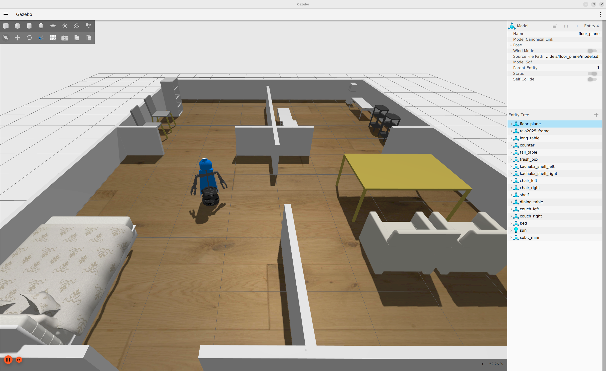

<a name="readme-top"></a>

[JA](README.md) | [EN](README.en.md)

[![Contributors][contributors-shield]][contributors-url]
[![Forks][forks-shield]][forks-url]
[![Stargazers][stars-shield]][stars-url]
[![Issues][issues-shield]][issues-url]
[![License][license-shield]][license-url]

# SOBIT MINI

<details>
  <summary>Table of Contents</summary>
  <ol>
    <li><a href="#overview">Overview</a></li>
    <li>
      <a href="#setup">Setup</a>
      <ul>
        <li><a href="#environment-requirements">Environment Requirements</a></li>
        <li><a href="#installation">Installation</a></li>
      </ul>
    </li>
    <li>
      <a href="#how-to-use">How to Use</a>
      <ul>
        <li><a href="#rviz-visualization">Visualization on Rviz</a></li>
      </ul>
    </li>
    <li>
      <a href="#software">Software</a>
      <ul>
        <li><a href="#joint-action-server">Joint Action Server</a></li>
        <li><a href="#linear-action-server">Linear Action Server</a></li>
        <li><a href="#pose-configuration">Pose Configuration</a></li>
      </ul>
    </li>
    <li>
      <a href="#hardware">Hardware</a>
      <ul>
        <li><a href="#how-to-download-parts">How to Download Parts</a></li>
        <li><a href="#electronic-circuit-diagram">Electronic Circuit Diagram</a></li>
        <li><a href="#robot-assembly">Robot Assembly</a></li>
        <li><a href="#robot-features">Robot Features</a></li>
        <li><a href="#bill-of-materials-bom">Bill of Materials (BOM)</a></li>
      </ul>
    </li>
    <li><a href="#milestones">Milestones</a></li>
    <li><a href="#references">References</a></li>
  </ol>
</details>

## Overview


This is a library for controlling SOBIT MINI, a dual-arm mobile manipulator developed by SOBITS.

> [!warning]
> If you are a beginner, make sure to operate the real robot under the supervision of experienced members.

## Setup
This section explains how to set up this repository.

### Environment Requirements
Before proceeding to installation, make sure the following environment is prepared.

| System  | Version |
| --- | --- |
| Ubuntu | 22.04 (Jammy Jellyfish) |
| ROS    | Humble Hawksbill |
| Python | 3.10 |

> [!NOTE]
> For installing `Ubuntu` and `ROS`, refer to the [SOBIT Manual](https://github.com/TeamSOBITS/sobits_manual#%E9%96%8B%E7%99%BA%E7%92%B0%E5%A2%83%E3%81%AB%E3%81%A4%E3%81%84%E3%81%A6).

### Installation

1. Move to the `src` folder of ROS2.
    ```sh
    cd ~/colcon_ws/src/
    ```

2. Clone this repository.
   ```sh
   git clone -b feature/multi_control https://github.com/TeamSOBITS/sobit_mini
````

3. Move into the repository.

   ```sh
   cd sobit_mini/
   ```

4. Install dependency packages.

   ```sh
   bash install.sh
   ```

5. Build the package.

   ```sh
   cd ~/colcon_ws
   colcon build --symlink-install
   source ~/colcon_ws/install/setup.sh
   ```

## How to Use

1. Launch the `minimal.launch` file.

   ```sh
   ros2 launch sobit_mini_bringup minimal.launch.py
   ```
2. [Optional] Change the robot pose.

   ```sh
   ros2 action send_goal /sobit_mini/move_to_pose sobits_interfaces/action/MoveToPose "pose_name: 'detecting_pose'
   time_allowance:
      sec: 5
      nanosec: 0"
   ```

### Run with [sobits_gazebo_worlds](https://github.com/TeamSOBITS/sobits_gazebo_worlds.git)

```sh
ros2 launch sobit_mini_bringup gz_minimal.launch.py
```

If everything works correctly, the robot and environment will be displayed as follows.



### Rviz Visualization

Before operating the real robot, you can visualize SOBIT MINI on Rviz to check the robot configuration.

```sh
ros2 launch sobit_mini_description display.launch.py
```

If successful, Rviz will display the robot as follows.


## Software

<details>
<summary>Summary of software related to SOBIT MINI</summary>

### Joint Action Server

1. `/sobit_mini/move_joint`: Move the specified joints to the target angles.

   ```sh
   ros2 action send_goal /sobit_mini/move_joint sobits_interfaces/action/MoveJoint "target_joint_names: ['head_camera_pan_joint', 'l_arm_shoulder_pan_joint']
   target_joint_rad: [0.5, -0.7]
   time_allowance:
      sec: 5
      nanosec: 0"
   ```

   <details>
   <summary>List of SOBIT MINI joint names</summary>

   | Joint Name                |
   | :------------------------ |
   | r_arm_shoulder_roll_joint |
   | r_arm_shoulder_pan_joint  |
   | r_arm_elbow_tilt_joint    |
   | r_arm_wrist_tilt_joint    |
   | r_hand_joint              |
   | l_arm_shoulder_roll_joint |
   | l_arm_shoulder_pan_joint  |
   | l_arm_elbow_tilt_joint    |
   | l_arm_wrist_tilt_joint    |
   | l_hand_joint              |
   | body_roll_joint           |
   | head_camera_pan_joint     |
   | head_camera_tilt_joint    |

2. `/sobit_mini/move_to_pose`: Move to a predefined pose.

   ```sh
   ros2 action send_goal /sobit_mini/move_to_pose sobits_interfaces/action/MoveToPose "pose_name: 'initial_pose'
   time_allowance:
      sec: 5
      nanosec: 0"
   ```

### Linear Action Server

1. `/sobit_mini/move_wheel_linear`: Move the robot at a specified speed.

   ```sh
   ros2 action send_goal /sobit_mini/move_wheel_linear sobits_interfaces/action/MoveWheelLinear "target_point:
      x: 0.5
      y: 0.0
      z: 0.0
   time_allowance:
      sec: 3
      nanosec: 0"
   ```

2. `/sobit_mini/move_wheel_rotate`: Rotate the robot to a specified angle.

   ```sh
   ros2 action send_goal /sobit_mini/move_wheel_rotate sobits_interfaces/action/MoveWheelRotate "target_yaw: -1.57
   time_allowance:
      sec: 5
      nanosec: 0"
   ```

#### Pose Configuration

You can add or edit poses in the [sobit_mini_pose.yaml](sobit_mini_library/config/pose_list.yaml) file.
The format is as follows:

```yaml
/**:
  ros__parameters:
    poses:
      - initial_pose

    initial_pose:
      r_arm_shoulder_roll :  0.0
      r_arm_shoulder_pan  :  1.25
      r_arm_elbow_tilt    :  0.0
      r_arm_wrist_tilt    :  0.0
      r_hand              :  0.0
      l_arm_shoulder_roll :  0.0
      l_arm_shoulder_pan  : -1.25
      l_arm_elbow_tilt    :  0.0
      l_arm_wrist_tilt    :  0.0
      l_hand              :  0.0
      body_roll           :  0.0
      head_camera_pan     :  0.0
      head_camera_tilt    :  0.0
```

</details>

## Hardware

SOBIT MINI is published as open-source hardware on [Onshape](https://cad.onshape.com/documents/8875b6e7a5f6f87b4f951969/w/d265c3a1708d61e2a005595d/e/00fdacbdb703dc27e5e0d3f8).


<details>
<summary>See here for detailed hardware information.</summary>

### How to Download Parts

1. Access Onshape.
2. Right-click on the part in the `Instance` list.
3. A list will appear, click the `Export` button.
4. In the displayed window, set the `Format` to `STEP`.
5. Finally, click the blue `Export` button to start the download.

### Electronic Circuit Diagram

TBD

### Robot Assembly

TBD

### Robot Features

| Item                 | Details                        |
| -------------------- | ------------------------------ |
| Max Linear Velocity  | 0.65 [m/s]                     |
| Max Angular Velocity | 3.1415 [rad/s]                 |
| Max Payload          | 0.35 [kg]                      |
| Size (L x W x H)     | 512 x 418 x 1122 [mm]          |
| Weight               | 11.6 [kg]                      |
| Remote Controller    | PS3/PS4                        |
| LiDAR                | UST-10LX                       |
| RGB-D                | Intel Realsense D435F          |
| Speaker              | Mono Speaker                   |
| Microphone           | Condenser Microphone           |
| Actuator (Arm)       | 2 x XM540-W150, 9 x XM430-W320 |
| Mobility             | TurtleBot2                     |
| Power Supply         | 2 x Makita 6.0Ah 18V           |
| PC Connection        | USB                            |

### Bill of Materials (BOM)

| Part | Model | Quantity | Purchase Link |
| ---- | ----- | -------- | ------------- |
| ---  | ---   | 1        | [link]()      |
| ---  | ---   | 1        | [link]()      |
| ---  | ---   | 1        | [link]()      |
| ---  | ---   | 1        | [link]()      |
| ---  | ---   | 1        | [link]()      |
| ---  | ---   | 1        | [link]()      |
| ---  | ---   | 1        | [link]()      |
| ---  | ---   | 1        | [link]()      |
| ---  | ---   | 1        | [link]()      |
| ---  | ---   | 1        | [link]()      |
| ---  | ---   | 1        | [link]()      |
| ---  | ---   | 1        | [link]()      |
| ---  | ---   | 1        | [link]()      |

</details>

## Milestones

* Add references
* Confirm and fix the operation of the library in the gazebo environment

Check the [Issue page][issues-url] for current bugs and feature requests.

## References
[contributors-shield]: https://img.shields.io/github/contributors/TeamSOBITS/sobit_mini.svg?style=for-the-badge
[contributors-url]: https://github.com/TeamSOBITS/sobit_mini/graphs/contributors
[forks-shield]: https://img.shields.io/github/forks/TeamSOBITS/sobit_mini.svg?style=for-the-badge
[forks-url]: https://github.com/TeamSOBITS/sobit_mini/network/members
[stars-shield]: https://img.shields.io/github/stars/TeamSOBITS/sobit_mini.svg?style=for-the-badge
[stars-url]: https://github.com/TeamSOBITS/sobit_mini/stargazers
[issues-shield]: https://img.shields.io/github/issues/TeamSOBITS/sobit_mini.svg?style=for-the-badge
[issues-url]: https://github.com/TeamSOBITS/sobit_mini/issues
[license-shield]: https://img.shields.io/github/license/TeamSOBITS/sobit_mini.svg?style=for-the-badge
[license-url]: LICENSE